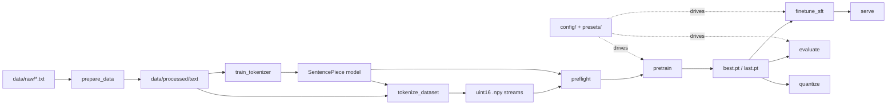

# Architecture

This document explains how Lloom is put together and, more importantly, *why* it
is built this way. The README covers what each part does; this is the design
rationale.

## The core idea: one code path, many models

Most from-scratch training repos grow a fork per experiment — a `model_gqa.py`
next to `model_moe.py`, a `train_lora.py` that drifted from `train.py`. Lloom
takes the opposite stance: there is **one** transformer implementation and **one**
set of trainers, and every architectural or training decision is a field in a
config. "A different model" is a different YAML file, never different code.

That constraint drives the whole design. It forces the model to express MHA, GQA,
MQA, dense and sparse (MoE) FFNs, full and sliding-window attention, and RoPE
context-scaling through the same forward pass, selected by `ModelConfig` fields.
The payoff is that experiments are reproducible (the resolved config is snapshotted
with every run), comparable (same code, only config differs), and cheap to start
(no new module to write).

## Layout: framework vs. project

The repo is split in two, and the split is load-bearing:

```
lloom/      the framework — knows nothing about any corpus, model, or task
textlm/     a reference project — corpus prep + SFT templating
config/     YAML that wires a project to the framework
scripts/    thin CLI entry points (Stages 0–5) over lloom + textlm
```

Nothing in `lloom/` imports from `textlm/`, `config/`, or `scripts/`. Corpus-specific
behavior arrives only through the sampler, the tokenizer, and the config object.
This is what makes the framework reusable: to train on your own data you edit
`textlm/` and `config/`, and `lloom/` never changes. It's also why `import lloom`
deliberately pulls in no torch — the top-level package is config and utilities;
the heavy subpackages (`lloom.model`, `lloom.train`, …) are imported explicitly
where they're needed.

## Pipeline



Every stage is a thin script over the framework; the heavy lifting lives in
`lloom/`. Stages hand off through files on disk (token streams, checkpoints),
which is what lets the pipeline resume and lets any stage run standalone.

## The config system

Configs merge in a fixed order, later winning:

```
base config   <   preset   <   --set overrides
```

Presets are partial YAMLs — usually a `model:` block plus a few training tweaks —
that layer over a base config, so a model-size change is a one-word `--preset`
flag. `--set training.optimizer=muon` handles one-off tweaks without editing
files. The fully resolved config is written next to each run
(`resolved_config.yaml`) so any run is exactly reproducible from its snapshot.

**Run identity.** A config that carries a `run_name` gets `${run_name}`
interpolated throughout the tree, so paths like
`runs/${run_name}/checkpoints/pretrain` namespace every run's artifacts. `run_name`
defaults to `default`; pass `--run-name large-muon` and that run's checkpoints,
logs, samples, and eval land under `runs/large-muon/` instead of clobbering the
last run. `default_run_name()` in `lloom/config.py` is the documented hook for
automatic per-config namespacing — swap it for a config fingerprint and runs
self-separate with no manual names.

## Model

`ModelConfig` is the single source of architectural truth — every field is a YAML
knob, and `__post_init__` validates the combination (e.g. `d_model` divisible by
`n_heads`, `moe_top_k <= n_experts`). The one transformer covers:

- **Attention:** MHA / GQA / MQA via `n_kv_heads`; optional per-head QK-norm
  (OLMo2/Qwen3-style); optional sliding-window. Built on PyTorch SDPA.
- **Positions:** RoPE with optional linear or NTK scaling, so trained context
  (`max_seq_len`) can be extended at inference without retraining.
- **FFN:** SwiGLU / GeGLU / GELU dense, or sparse MoE (top-k routing with a
  Switch-style load-balancing aux loss) by setting `n_experts`.
- **Norm/head:** RMSNorm or LayerNorm; tied or untied embeddings; optional
  gradient checkpointing for memory; KV-cache decoding for generation.

The embedding/head is padded to a multiple of 64 for tensor-core efficiency, and
the real token count is recorded so generation masks the padding ids and never
samples a dead token.

## Data

Tokenized corpora are stored as **uint16 `.npy` memmap streams**: a many-GB corpus
costs a few MB of RAM to train on, and resuming is free because position is just an
offset. A **weighted mixture sampler** draws across multiple sources by curriculum
`tier`, monitors realized vs. target mix, and warns on divergence. For SFT, examples
are **packed** to fill sequences (first-fit decreasing) with **prompt masking** and
**block-diagonal attention** so packed examples don't attend across each other —
you get throughput without contaminating the loss.

## Training

`Trainer` (pretrain) and `SFTTrainer` share the infrastructure: checkpoint/resume
with full RNG state, mixed-precision autocast, gradient clipping, and dual logging.

- **Optimizers:** AdamW, Muon (Newton–Schulz-orthogonalized momentum on 2D
  weights), Lion — plus a `MultiOptimizer` to run Muon on hidden matrices and
  AdamW on the rest.
- **Schedules:** cosine, WSD (warmup-stable-decay), linear, constant.
- **Objectives:** causal LM, optionally mixed per-micro-batch with span corruption.
- **Logging:** an append-only `CSVLogger` that survives with no external service
  (it grows its header when validation adds `val/*` columns), and an optional
  no-op-unless-enabled `WandbLogger` so a run never blocks on a logging service.
- **Checkpointing:** `last.pt` carries optimizer state (the resume point);
  `best.pt` and rolling `step_*.pt` are model-only to roughly halve I/O.
  Early stopping tracks validation loss with patience.

## Finetuning, inference, quantization, eval

- **Finetune (`lloom.finetune`):** LoRA inject / merge / save-adapter. Train low-rank
  adapters, then either ship the adapter or merge it back into the base weights.
- **Inference (`lloom.infer`):** KV-cache generation, checkpoint loading,
  safetensors export, and an optional FastAPI/SSE server (an extra, so the core
  install stays lean).
- **Quantization (`lloom.quant`):** dynamic int8 with a safetensors round-trip.
- **Eval (`lloom.eval`):** perplexity (in-domain + OOD), embedding retrieval
  (MRR/NDCG), and clustering, behind a unified `Evaluator`. Generation/retrieval/
  clustering activate only when their data files exist, and the evaluator prefers a
  held-out `data/test/` split over the SFT training set, warning when it has to
  fall back (so scores aren't quietly flattering).

## Pipeline automation

`lloom.pipeline` chains stages from a YAML recipe with stage selection, `skip_if`
guards (skip tokenizer training if the model already exists), `--dry-run`, and
override pass-through. `run_pipeline` resolves `run_name` once and forwards it to
every stage, so a whole `pretrain → sft → release` sequence lands under one run
directory.

## Testing strategy

Two suites, deliberately split:

- `tests/test_lloom.py` exercises every subsystem on synthetic tensors — fast, CPU,
  no corpus or tokenizer training. It catches logic regressions in isolation.
- `tests/test_scripts_smoke.py` runs the *real* CLI end to end (prepare → tokenizer →
  tokenize → preflight → pretrain → evaluate) on a tiny synthetic corpus with the
  `nano` preset, in a throwaway copy of the repo. It catches the stage-wiring and
  path-handoff bugs that unit tests structurally can't see.

CI runs both on Python 3.10–3.12 with CPU PyTorch, plus a ruff lint gate.
